<h1 align="center">Hotel Booking Web App</h1>
  <p align="center">
    A property room booking web app with MERN Stack.    <br />
  </p>
</p>

<!-- TABLE OF CONTENTS -->
<details open="open">
  <summary>Table of Contents</summary>
  <ol>
    <li>
      <a href="#about-the-project">About The Project</a>
      <ul>
        <li><a href="#built-with">Built With</a></li>
      </ul>
    </li>
    <li>
      <a href="#getting-started">Getting Started</a>
      <ul>
        <li><a href="#prerequisites">Prerequisites</a></li>
        <li><a href="#installation">Installation</a></li>
      </ul>
    </li>
    <li><a href="#roadmap">Roadmap</a></li>
    <li><a href="#contributing">Contributing</a></li>
    <li><a href="#contact">Contact</a></li>  </ol>
</details>

<!-- ABOUT THE PROJECT -->

## About The Project


<br>

Simple Property booking app with content management system. Users can book rooms in different properties for specific dates. Property managers can create, update, delete a property and its rooms. Admin can manage everything in the app.

### Built With

- [React](https://reactjs.org/)
- [Node JS](https://nodejs.org/en/)
- [Express JS](https://expressjs.com/)
- [GraphQL](https://graphql.org/)
- [MongoDB](https://www.mongodb.com/)
- [Stripe](https://stripe.com/en-in)

<!-- GETTING STARTED -->

## Getting Started

To get a local copy up and running follow these simple example steps.

### Prerequisites

These things must be installed in your system.

- [NPM](https://nodejs.org/en/)

### Installation

1. Open the project folder
2. Now open MongoDB
3. Create a database collection
4. Copy connection url
5. Now run
   ```sh
   cd server
   ```
6. Create .env file
7. Paste the connection url of DB with key name = MONGO_URL
8. Now run commands
   ```sh
   npm i
   nodemon server.js
   ```
9. Now open new terminal
10. Now run commands
    ```sh
    cd client
    npm i
    npm start
    ```

<!-- USAGE EXAMPLES -->

## Usage

Here are some examples of how our app works.

Login credentials:
Email: admin2023@gmail.com
Pass: 1234

<br>
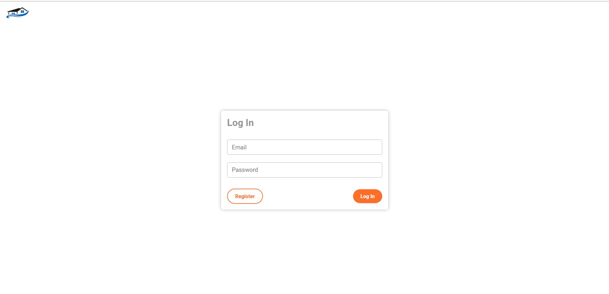
<br>
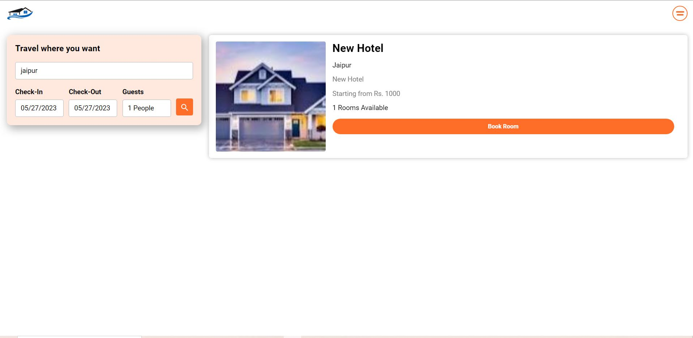
<br>
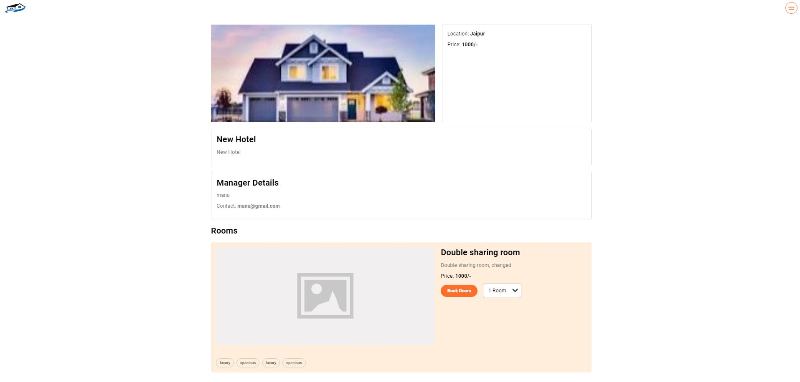
<br>
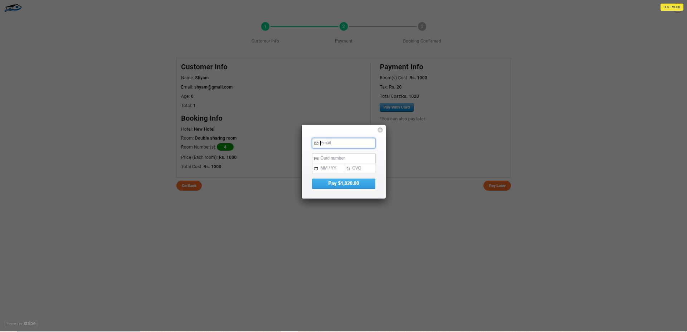
<br>
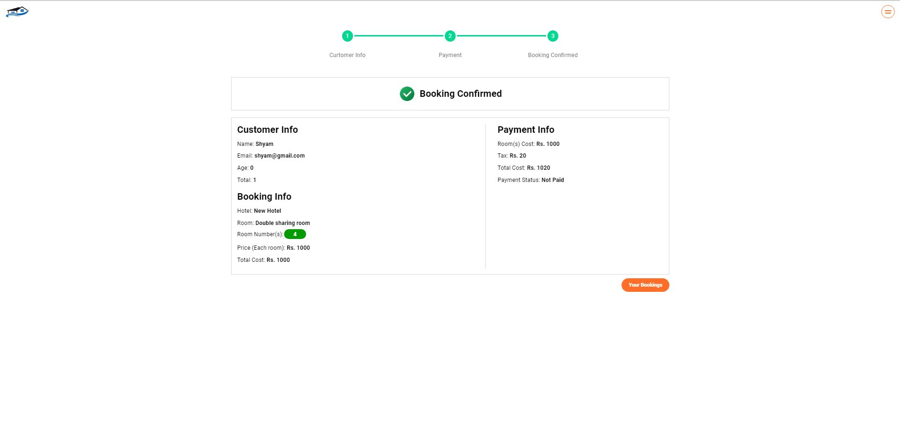
<br>
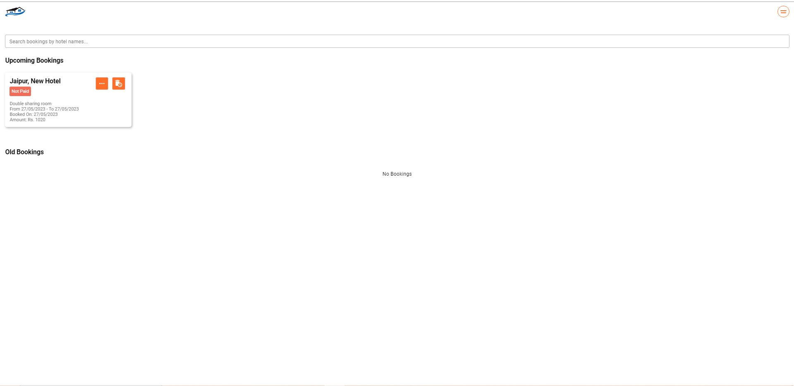
<br>
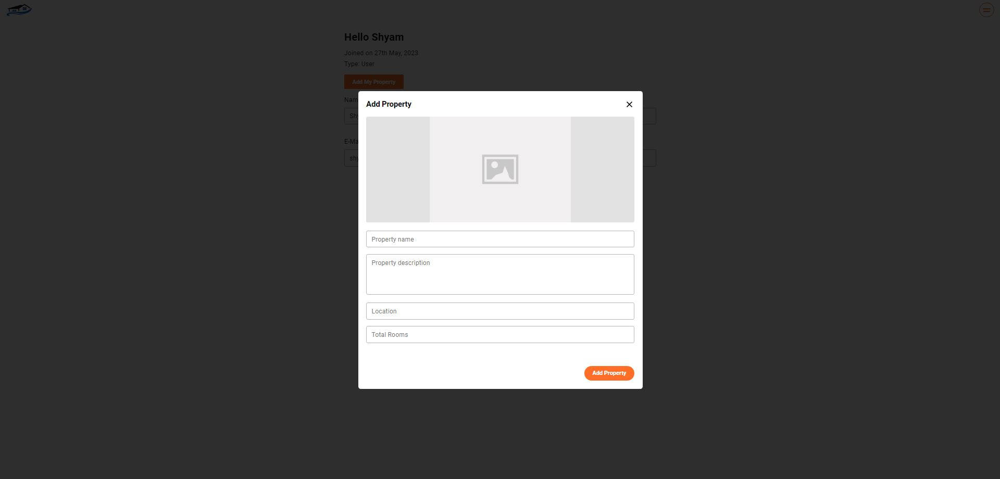
<br>
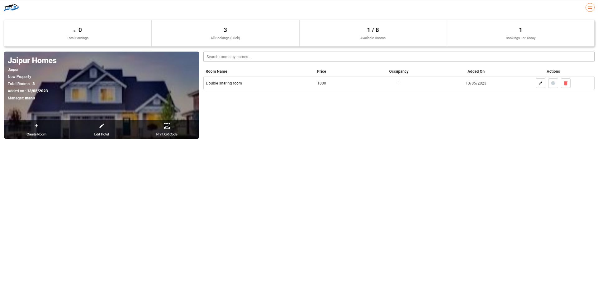
<br>
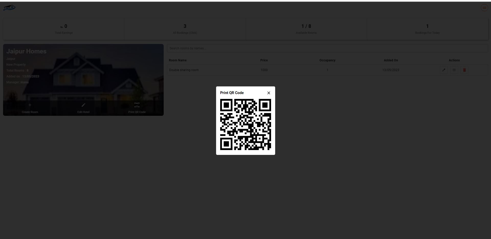
<br>
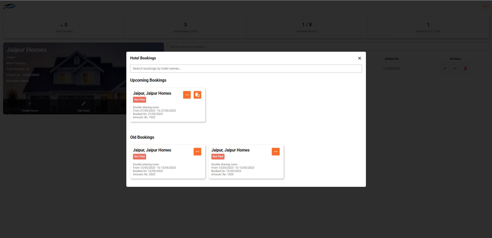
<br>
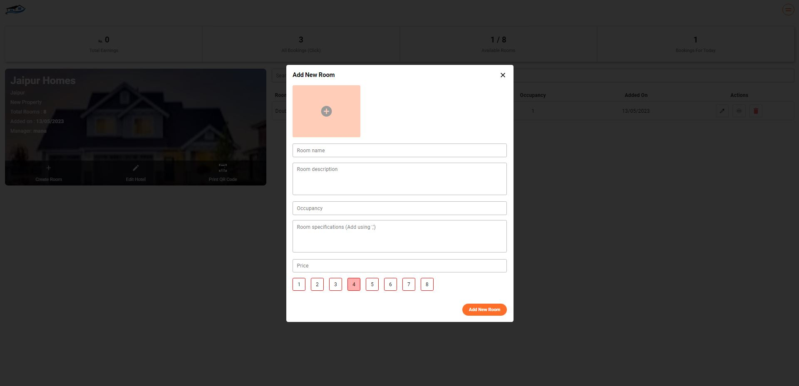
<br>
